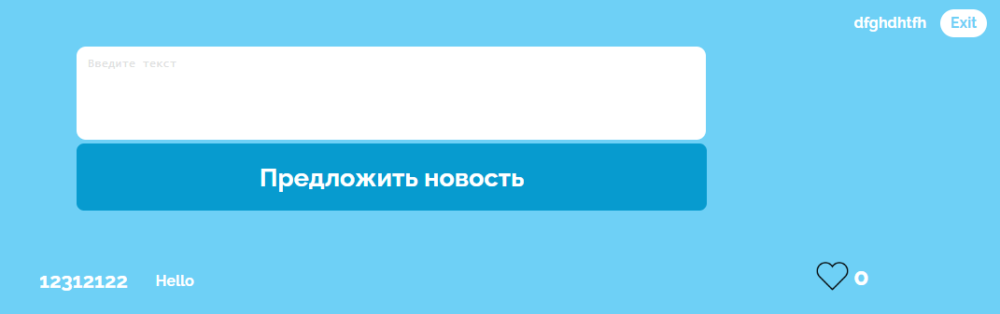

# Реализация шаблона CRUD

## Цель работы:
Разработать и реализовать клиент-серверную информационную систему, реализующую механизм CRUD.

## Задание:
- добавление текстовых заметок в общую ленту
- реагирование на чужие заметки (лайки)
## Ход работы:
- Разработать пользовательский интерфейс
- Описать сценарии работы
- Описать API сервера и хореографию
- Описать структуру БД и алгоритмы обработки данных
- Написать программный код
- Удостовериться в корректности кода
## Пользовательский интерфейс

## Пользовательский сценарий
1. Пользователь вводит сообщение, нажимает кнопку "Предложить новость", чтобы отправить сообщение на сайт - сообщение успешно загружается и попадает наверх списка, остальные сообщения сдвигаются вниз.
2. Пользователь видит сообщение которое ему понравилось и нажимает кнопку Like. Счетчик лайков на данном посте увеличивается на 1.
## Описание API сервера и его хореографии
Сервер использует HTTP POST запросы для выгрузки комментариев в базу данных.

1. Алгоритм отправки сообщения - после проверки на заполненность полей в базу данных отправляется запрос, добавляющий комментарий в БД с текстом сообщения.
2. Алгоритм добавления лайка - при нажатии на кнопку "Like" на определённом сообщении страница обновляется и счётчик возрастает на единицу.
## Описание структуры базы данных
#### `users`

| id | mail | login | pass |

В этой таблице:

- **id** - уникальный идентификатор пользователя (int);

- **mail** - почта пользователя (varchar(100));

- **login** - имя пользователя (varchar(100));

- **pass** - хэш пароля (varchar(60));

Таблица используется для хранения всех зарегистрированных пользователей.

#### `posts`

| id | user | text | likes | dislikes | image |

В этой таблице:

- **id** - уникальный идентификатор заметки (int);

- **user** - имя пользователя(автора), кто написал заметку (varchar(100));

- **text** - текст заметки (text);

- **likes** - колличество лайков для данного поста (int(100));

- **image** - изображение для данного поста (longblob);

Таблица используется для хранения заметок.

#### `posts_like`

| id_post | id_user |

В этой таблице:

- **id_post** - идентификатор поста к которому был поставлен лайк (varchar(255));

- **id_user** - идентификатор пользователя который поставил лайк (varchar(255));

Таблица используется для хранения пользователей, которые поставили лайки к конкретным постам.

## Значимые фрагменты кода
1. Алгоритм отправки комментария в базу данных
```
$text = filter_var(trim($_POST['message']), FILTER_SANITIZE_STRING);
$user = $_COOKIE['user'];

$mysql_posts = new mysqli('localhost', 'root', 'root', 'lab_2_nikita');
$mysql_posts->query("INSERT INTO `posts` (`user`,`text`, `likes`) VALUES ('$user', '$text', '0')");
```
2. Алгоритм вывода комментариев на сайт
```
$connect = mysqli_connect('localhost', 'root', 'root', 'lab_2_nikita');
                    $mysql = mysqli_query($connect, "SELECT * FROM `posts` order by id desc");
                    $count = 0;

                    if($mysql->num_rows > 0) {
                        while ($row = $mysql->fetch_assoc()) {
                            if($count <= 100) {
                                $user = $row;
                                $user_id = $user['id'];
                                $user_id = (int)$user_id;

                                $post =  '
                                <div class="news__content">
                                    <h3 class="news__user">'.htmlspecialchars($user['user']).'</h3>
                                    <p class="news__text">'.htmlspecialchars($user['text']).'</p>
                                    <div class="feedback">
                                        <form action="posts/like.php" method="post">
                                            <input type="hidden" value="'.$user_id.'" name="post_id">
                                            <button type="submit" class="like" name="like">
                                                
                                                <p class="counter__like">'.htmlspecialchars($user['likes']).'</p>
                                            </button>
                                        </form>
                                    </div>
                                </div>
                            '."\n";

                                echo $post;
                                $comment = '';
                                $count++;
                            }
                        }
                    }
```
3. Функция добавления лайка на комментарий
```
<?php

$post_id = filter_var(trim($_POST['post_id']), FILTER_SANITIZE_STRING);

$mysql = new mysqli('localhost', 'root', 'root', 'login_form');
$mysql_user = $mysql->query("SELECT * FROM `users` WHERE login = '{$_COOKIE['user']}'");
$mysql_user = $mysql_user->fetch_assoc();
$user_id = $mysql_user['id'];

$mysql1 = new mysqli('localhost', 'root', 'root', 'lab_2_nikita');
$mysql_post = $mysql1->query("SELECT COUNT(*) as count FROM posts_like where id_post = $post_id ");
$mysql_post = $mysql_post->fetch_assoc();
$like_count = $mysql_post["count"];

$mysql2 = new mysqli('localhost', 'root', 'root', 'lab_2_nikita');
$mysql_date = $mysql2->query("SELECT * FROM posts_like WHERE id_post=$post_id AND id_user=$user_id");
$mysql_user = $mysql_date->fetch_assoc();


if($mysql_date -> num_rows > 0) {
    $like_count = $like_count - 1;

    $mysql2->query("DELETE FROM posts_like WHERE id_post = $post_id AND id_user = $user_id");
    $mysql1->query("UPDATE posts SET likes = $like_count WHERE id = $post_id");
    header('Location: /lab_2_nikita/main.php');

} else {
        $like_count = $like_count + 1;

        $mysql2->query("INSERT INTO posts_like (id_post, id_user) VALUES ($post_id, $user_id)");
        $mysql1->query("UPDATE posts SET likes = $like_count WHERE id = $post_id");
        header('Location: /lab_2_nikita/main.php');
}
```
